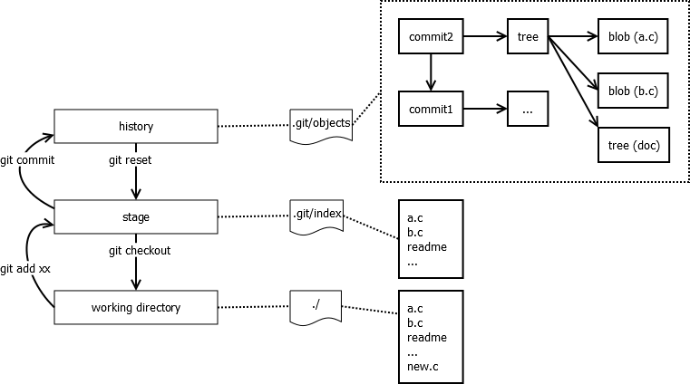

## Git

### git
理解git里的三个区域概念非常重要。git里很多常用的命令都是围绕着这三个区域来做的。它们分别为：

- working directory
也就是你所操作的那些文件

- history，你所提交的所有记录，文件历史内容等等。git是个分布式版本管理系统，在你本地有项目的所有历史提交记录；文件历史记录；提交日志等等。

- stage(index)
暂存区域，本质上是个文件，也就是.git/index

git中还有三类常用对象（实际不止三种），理解这三类对象也很重要。分别为：

- blob
用于表示一个文件

- tree
用于表示一个目录，索引到若干文件或子目录

- commit
用于表示一次提交(commit)



### git reset

- `git reset HEAD^ a.py`
回退a.py这个文件的版本到上一个版本

- `git reset HEAD~1`
默认为 `--mixed`, `git status` 后为 Changes not staged for commit:

- `git reset --soft HEAD~1`
`git status` 后为 Changes to be committed:

- `git reset --hard HEAD~1`
所有更改都被丢弃

### git stash

- `git stash`
备份当前的工作区的内容，从最近的一次提交中读取相关内容，让工作区保证和上次提交的内容一致。同时，将当前的工作区内容保存到Git栈中。

- `git stash pop`
从Git栈中读取最近一次保存的内容，恢复工作区的相关内容。由于可能存在多个Stash的内容，所以用栈来管理，pop会从最近的一个stash中读取内容并恢复。

- `git stash list`
显示Git栈内的所有备份，可以利用这个列表来决定从那个地方恢复。

- `git stash clear`
清空Git栈。此时使用gitg等图形化工具会发现，原来stash的哪些节点都消失了

- `git stash --keep-index`

### git show

- `git show ebff`
查 log 是 commit ebff810c461ad1924fc422fd1d01db23d858773b 的內容

- `git show v1`查 tag:v1
的修改內容

- `git show v1:test.txt`
查 tag:v1 的 test.txt 檔案修改內容

- `git show HEAD`
此版本修改的資料

- `git show HEAD^`
前一版修改的資料

- `git show HEAD^^`
前前一版修改的資料

- `git show HEAD~4`
前前前前一版修改的資料

### git grep

- `git grep "te" v1`
查 v1 是否有 "te" 的字串

- `git grep "te"`
查現在版本是否有 "te" 的字串

### git push

- `git push origin master:4.1`
if remote 4.1 branch is after master branch, use this command will keep 4.1 update with master

#### git branch

- change branch name
`git branch -m <oldname> <newname>`

- If you want to rename the current branch, you can simply do:
`git branch -m <newname>`

- 将名称为[name]的分支与当前分支合并
`git merge [name]`

- -d选项只能删除已经参与了合并的分支，对于未有合并的分支是无法删除的。如果想强制删除一个分支，可以使用-D选项
`git branch -d [name]`

- 删除远程分支
`git push origin :remote-branch`

- git fetch all remote branch info
`git fetch git@github.com:haiwen/seahub.git`

- git fetch singal remote branch info
`git fetch origin notice:notice`

- git list remote branch
`git branch -r`

- git add remote branch to local
`git checkout -b LocalBranchName origin/branch`

- git push local branch to origin master
`git push origin local-branch:master`

### git remote

- `git clone git://github.com/jquery/jquery.git`
检出仓库：

- `git remote -v`
查看远程仓库：

- `git remote add [name] [url]`
添加远程仓库：

- `git remote rm [name]`
删除远程仓库：

- `git remote set-url --push [name] [newUrl]`
修改远程仓库：

- `git pull [remoteName] [localBranchName]`
拉取远程仓库：

- `git push [remoteName] [localBranchName]`
推送远程仓库

- `git push origin test:master`
提交本地test分支作为远程的master分支

- `git push origin test:test`
提交本地test分支作为远程的test分支

## Trouble Shoot

#### .gitignore does not work

```
git rm --cached -r .
git add .
git status
```

This will stash everything that you haven't previously added. Just git add the things you want to keep, then run it.
