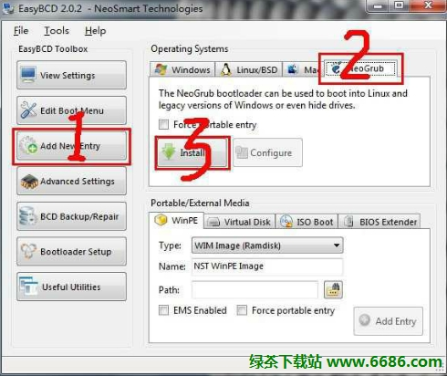
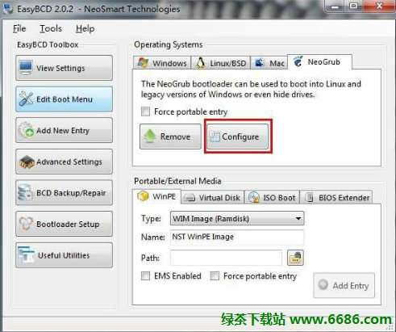

## Install & Configure

- Update Source

```
sudo mv /etc/apt/sources.list /etc/apt/sources.list.backbone
sudo mv sources.list /etc/apt/
sudo apt-get update
sudo apt-get upgrade
```

- Install Software

```
sudo apt-get install git openssh-server libevent-dev libcurl4-openssl-dev libglib2.0-dev uuid-dev intltool libsqlite3-dev libmysqlclient-dev libarchive-dev libtool libjansson-dev valac libfuse-dev python-dateutil cmake re2c flex sqlite3 python-pip python-simplejson tree ctags libjpeg-dev libfreetype6 libfreetype6-dev zlib1g-dev libncurses5-dev libgnome2-dev libgnomeui-dev libgtk2.0-dev libatk1.0-dev libbonoboui2-dev libcairo2-dev libx11-dev libxpm-dev libxt-dev python-dev ruby-dev mercurial ibus ibus-clutter ibus-gtk ibus-gtk3 ibus-qt4 ibus-sunpinyin openssh-client

sudo pip install pillow Flask-SQLAlchemy pyflakes nose
```

- Install Vim74

```
sudo apt-get remove vim vim-runtime gvim remove vim-tiny vim-common vim-gui-common

wget ftp://ftp.vim.org/pub/vim/unix/vim-7.4.tar.bz2
tar -xf vim-7.4.tar.bz2

cd vim74
./configure --with-features=huge \
            --enable-multibyte \
            --enable-rubyinterp \
            --enable-pythoninterp \
            --with-python-config-dir=/usr/lib/python2.7/config \
            --enable-perlinterp \
            --enable-luainterp \
            --enable-gui=gtk2 --enable-cscope --prefix=/usr
make VIMRUNTIMEDIR=/usr/share/vim/vim74

sudo make install

sudo update-alternatives --install /usr/bin/editor editor /usr/bin/vim 1
sudo update-alternatives --set editor /usr/bin/vim
sudo update-alternatives --install /usr/bin/vi vi /usr/bin/vim 1
sudo update-alternatives --set vi /usr/bin/vim

mkdir .vim
cd .vim
mkdir Bundle
git clone https://github.com/gmarik/Vundle.vim.git ~/.vim/bundle/Vundle.vim

Launch `vim` and run `:PluginInstall`

cd ~/.vim/bundle/YouCompleteMe
./install.sh

cp grep.vim ~/.vim/plugin
```

## Tips

#### Vim Tags

```
cd dev
ctags -R
```

#### Bash

```
vi .bashrc

alias e='exit'
alias c='clear'

PS1='${debian_chroot:+($debian_chroot)}\[\033[01;36m\]\u@\h\[\033[00m\]:\[\033[01;36m\]\w\[\033[00m\]\$ '
```

#### [HAProxy](http://www.sysads.co.uk/2014/08/install-haproxy-1-5-6-on-ubuntu-14-04/)

```
sudo apt-add-repository ppa:vbernat/haproxy-1.5
sudo apt-get update
sudo apt-get install haproxy
```

#### [Linux服务器的初步配置流程](http://www.admin10000.com/document/4070.html)

#### Install Ubuntu From Hard Dist On WIndows




After click **configure**, write the following lines into the ***.txt*** popup.

```
title Install Ubuntu
root (hd0,0)
kernel (hd0,0)/vmlinuz.efi boot=casper iso-scan/filename=/ubuntu-12.04-desktop-amd64.iso ro quiet splash locale=zh_CN.UTF-8
initrd (hd0,0)/initrd.lz
```

Copy ***initrd.lz*** and ***vmlinuz.efi*** and ***.iso*** to `(hd0,0)`, then **restart**.

> **NOTE:** Before install Ubuntu, `sudo umount -l /isodevice`.

#### error while loading shared libraries:

cannot open shared object file: No such file or directory

`sudo ldconfig`

> 主要是在默认搜寻目录( ***/lib*** 和 ***/usr/lib*** )以及动态库配置文件 ***/etc/ld.so.conf*** 内所列的目录下,
> 搜索出可共享的动态链接库(格式如 `lib*.so*` ), 进而创建出动态装入程序( `ld.so` )所需的连接和缓存文件.
> 缓存文件默认为 ***/etc/ld.so.cache*** , 此文件保存已排好序的动态链接库名字列表.

#### chrome书签栏，中文乱码问题解决

`sudo apt-get install ttf-wqy-microhei ttf-wqy-zenhei xfonts-wqy`

#### [About Ibus Chinese Input](http://askubuntu.com/questions/450536/my-ibus-pinyin-broke-with-14-04-release-upgrade)

`ibus write-cache`

#### Add Public SSH Key to Remote Server in a Single Command

```
ssh-keygen -t rsa
cat ~/.ssh/id_rsa.pub | ssh user@hostname 'cat >> .ssh/authorized_keys'
```

#### VM虚拟机CentOS配置自动获取IP地址

`vi /etc/sysconfig/network-scripts/ifcfg-eth0`

change `ONBOOT="no"` to `ONBOOT="yes"`

`service network restart`

`ifconfig`

#### 遇到 `sudo` 重定向权限不够的问题

众所周知，使用 `echo` 并配合命令重定向是实现向文件中写入信息的快捷方式。本文介绍如何将 `echo` 命令与 `sudo` 命令配合使用，实现向那些只有系统管理员才有权限操作的文件中写入信息。

比如要向 ***test.asc*** 文件中随便写入点内容，可以： `echo some_msg > test.asc` 或者 `echo some_msg >> test.asc`

下面，如果将 `test.asc` 权限设置为只有 `root` 用户才有权限进行写操作：

`sudo chown root.root test.asc`

然后，我们使用 `sudo` 并配合 `echo` 命令再次向修改权限之后的 ***test.asc*** 文件中写入信息：

`sudo echo "又一行信息" >> test.asc`
> -bash: test.asc: Permission denied

这时，可以看到 **bash** 拒绝这么做，说是权限不够。这是因为重定向符号 `>` 和 `>>` 也是 **bash** 的命令。我们使用 `sudo` 只是让 `echo` 命令具有了 `root` 权限，但是没有让 `>` 和 `>>` 命令也具有 `root` 权限，所以 **bash** 会认为这两个命令都没有像 ***test.asc*** 文件写入信息的权限。

解决这一问题的途径有两种。

- 第一种是利用 `sh -c` 命令，它可以让 **bash** 将一个字串作为完整的命令来执行，这样就可以将 `sudo` 的影响范围扩展到整条命令。具体用法如下：
`sudo sh -c 'echo another_msg >> test.asc'`

- 另一种方法是利用管道和 `tee` 命令，该命令可以从标准输入中读入信息并将其写入标准输出或文件中，具体用法如下：
代码:
`echo another_msg | sudo tee -a test.asc`

> 注意，`tee` 命令的 `-a` 选项的作用等同于 `>>` 命令，如果去除该选项，那么 > `tee` 命令的作用就等同于 `>` 命令。

#### when `sudo rfkill list all` show `Hard blocked: yes`

```
sudo rmmod -f ath5k
sudo rfkill unblock all
sudo modprobe ath5k
```
